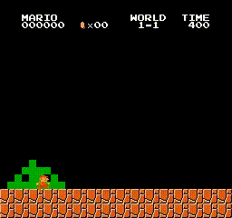

# Mario Ai


A Team Project for applied reinforcement learning.

Keywords: Reinforcement Learning, CNN, DQL


## Introduction
<p align="justify">
Reinforcement learning is popular for training an agent to solve a task independently. An agent learns to act in an environment through trials and feedback in form of reward. In the reinforcement learning project, we trained a super mario agent with acquired knowledge from the theoretical part of the course and additional sources on Internet. Our agent is trained with a Deep Q-Network with Prioritized Replay Buffer and Dueling Network. Eventually, it can survive the first level of the super mario game. 
In this report, we will first introduce the theoretical supports for the experiment. Then, we will briefly illustrate the environment and the framework of the super mario game. Afterward, we will report the issues we encountered during the training and the corresponding solutions. Finally, we will show the result of our training and conduct short conclusion.
</p>

## Videos
Some videos of the trained model are available in the video folder.

## Setup

### System:
- Python 3.5<

### Requirements:
- Tensorflow
- gym>=0.9.6'
- Baselines
- gym-super-mario-bros 3.0.0

### Installation:
For gym-super-mario-bros follow the install instructions at https://github.com/Kautenja/gym-super-mario-bros. Gym installation instructions are available at https://github.com/openai/gym. 


## commands

Train:
```bash 
python3 agents/deepq.py
```
The model is stored in the models folder.


Enjoy:
Change the path in the code to the model you want to execute.
```bash 
python3 agents/replay.py
```
The replays are stored in the video folder.


## Cite
To cite this repository in publications:

    @misc{Lemke2018Reinf,
      author = {Chen, Xingying and Lemke, Christian},
      title = {Applied Reinforcement Learning on Super-Mario-Bros.},
      year = {2018},
      publisher = {GitHub},
      journal = {GitHub repository},
      howpublished = {\url{https://github.com/ChristianLemke/mario_ai}},
    }
